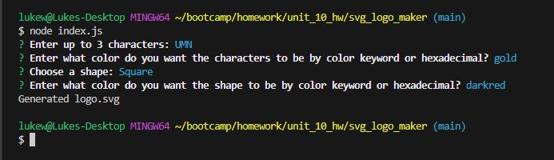
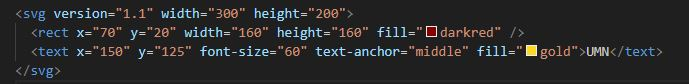
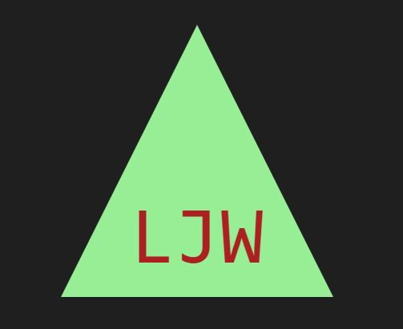

# SVG Logo Maker

## Description
This is application allows the user to quickly generate a simple logo for their projects. This logo will be a 200x300px SVG file.

## Table of Contents
- [Installation](#installation)
- [Usage](#usage)
- [Questions](#questions)
- [Acknowledgements](#acknowledgements)
- [Preview](#preview)

  
## Installation
1) Download repository
2) Run 'npm init' in command prompt after downloading

## Usage
When run, the user is asked to enter 1-3 characters for their logo. They are then asked what color to make those characters. After that, they'll be prompted for a shape (square, circle, or triangle) and what color it should be. The color can be either a color keyword that's accepted by SVG OR a hexadecimal number. For a list of apporpriate color keywords, [click here](https://johndecember.com/html/spec/colorsvg.html).

Once the user as answered all four questions, a `logo.svg` file is generated and saved to the `new_SVG-file` folder. The command line will also show "Generated logo.svg".

## Questions
Questions can be received on the [Github Repository](https://github.com/Wald14/svg-logo-maker) for this application. Please make a new issue.

## Acknowledgements
- Gary Almes (Professor)
- Ben Martin and Katy Vincent (TA)
- [W3School](https://www.w3schools.com/)
- [MDN Web Docs](https://developer.mozilla.org/)
- [Stack Overflow](https://stackoverflow.com)

## Preview
A video of the application in use can be accessed [here](https://drive.google.com/file/d/1gUPfZvAGq3TULeKIly-uiXx1J4wbAvQG/view). The following images share the application's apperance:

Preview of terminal prompts

Preview of generated sqaure svg code

Example of a square logo.SVG

Example of a circle logo.SVG

Example of a triangle logo.svg

